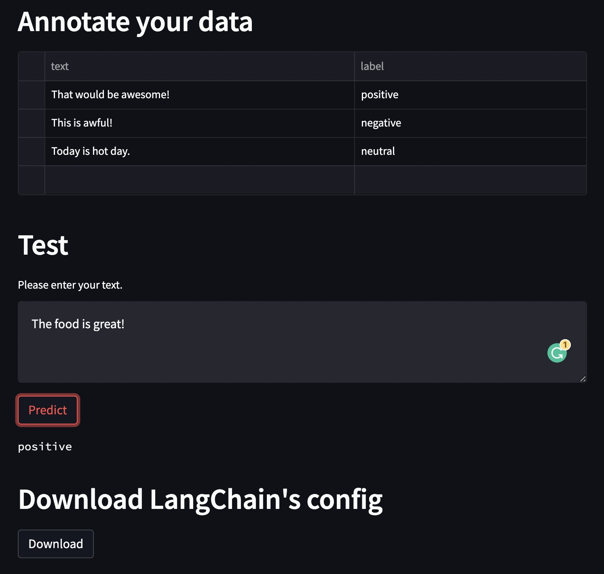

# doccano-mini

doccano-mini is a few-shot annotation tool to assist the development of applications with Large language models (LLMs). Once you annotate a few text, you can test your task (e.g. text classification) with LLMs, then download the [LangChain](https://github.com/hwchase17/langchain)'s config.



Note: This is an experimental project.

## Installation

```bash
pip install doccano-mini
```

## Usage

For this example, we will be using OpenAI’s APIs, so we need to set the environment variable in the terminal.

```bash
export OPENAI_API_KEY="..."
```

Then, we can run the server.

```bash
doccano-mini
```

Now, we can open the browser and go to `http://localhost:8501/` to see the interface.

## Development

```bash
poetry install
streamlit run doccano_mini/app.py
```
